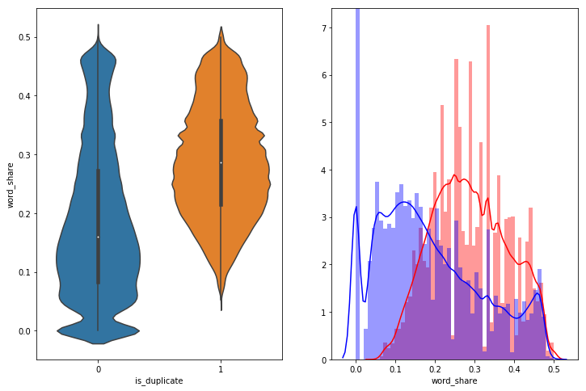
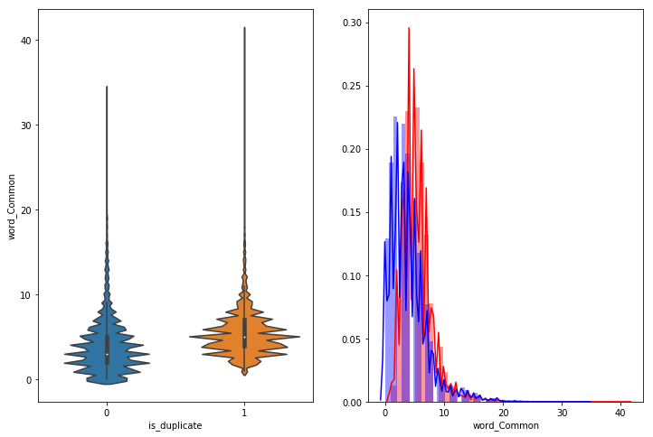
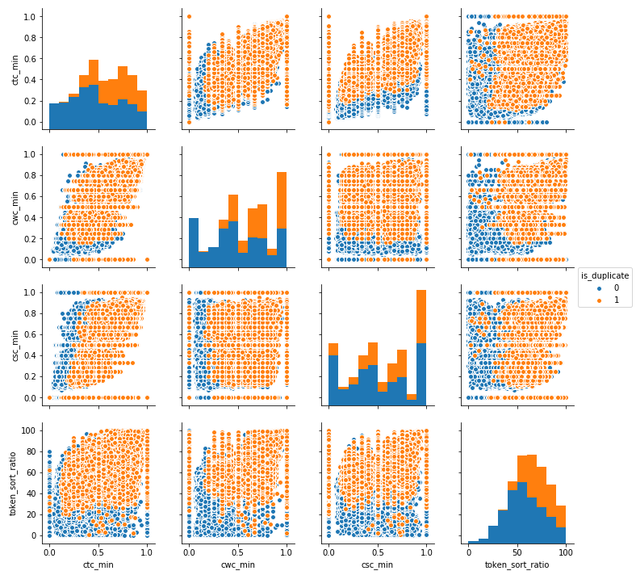
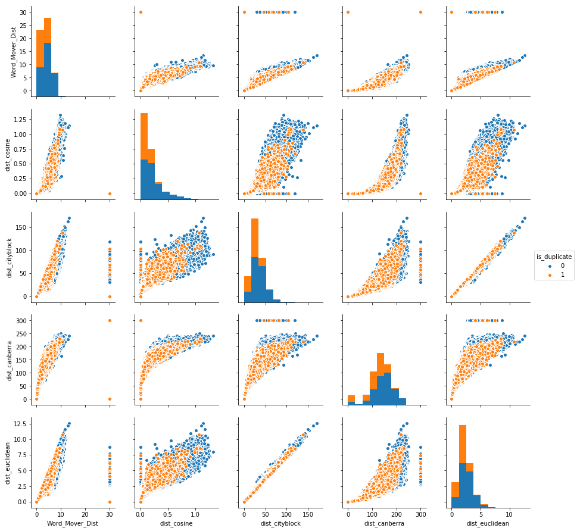

# Quora-Question-pair

## Overview
The objective of this project was to use MAchine Learning models to predict if a pair of quora question are similar or not (duplicate or not). Its basically a binary classification problem with some learning on natural language processing and python functions.

## About
Where else but Quora can a physicist help a chef with a math problem and get cooking tips in return? Quora is a place to gain and share knowledge—about anything. It’s a platform to ask questions and connect with people who contribute unique insights and quality answers. This empowers people to learn from each other and to better understand the world.

Over 100 million people visit Quora every month, so it's no surprise that many people ask similarly worded questions. Multiple questions with the same intent can cause seekers to spend more time finding the best answer to their question, and make writers feel they need to answer multiple versions of the same question. Quora values canonical questions because they provide a better experience to active seekers and writers, and offer more value to both of these groups in the long term.

Currently, Quora uses a Random Forest model to identify duplicate questions. In this competition, Kagglers are challenged to tackle this natural language processing problem by applying advanced techniques to classify whether question pairs are duplicates or not. Doing so will make it easier to find high quality answers to questions resulting in an improved experience for Quora writers, seekers, and readers.

## Problem Statement :
  - Identify which questions asked on Quora are duplicates of questions that have already been asked.

## Technical Aspect
This project is divided into 4 part:
1. EDA of original Data
2. Basic Feature extraction and EDA
3. Fuzzy feature Extraction and EDA
4. Model Building

## Run
Run each ipython file one by one. You can use kaggle or colab.

## Data fields
  - id - the id of a training set question pair
  - qid1, qid2 - unique ids of each question (only available in train.csv)
  - question1, question2 - the full text of each question
  - is_duplicate - the target variable, set to 1 if question1 and question2 have essentially the same meaning, and 0 otherwise.

## Real world/Business Objectives and Constraints :
 - The cost of a mis-classification can be very high.
 - You would want a probability of a pair of questions to be duplicates so that you can choose any threshold of choice.
 - No strict latency concerns.
 - Interpretability is partially important.

## Performance Metric:
 - log-loss 
 - Binary Confusion Matrix

## Some Features analysis and visualizations:
  - ##### word_share - We can check from below that it is overlaping a bit, but it is giving some classifiable score for disimilar questions.
     
  - ##### Word Common - it is almost overlaping.
     
  - ##### Bivariate analysis of features 'ctc_min', 'cwc_min', 'csc_min', 'token_sort_ratio'. We can observe that we can divide duplicate and non duplicate with some of these features with some patterns. 
     
  - ##### Bivariate analysis of features 'Word_Mover_Dist', 'dist_cosine', 'dist_cityblock', 'dist_canberra','dist_euclidean'.This also giving some patterns to classify.
     

### Machine Learning Models:
   - Trained a random model to check Worst case log loss and got log loss as 0.887699
   - Trained some models and also tuned hyperparameters using Random and Grid search. I didnt used total train data to train my algorithms. Because of ram availability constraint in my PC, i sampled some data and Trained my models. below are models and their logloss scores. you can check total modelling and feature extraction 
   For below table BF - Basic features, AF - Advanced features, DF - Distance Features including WMD.

| Model         | Features Used | Log Loss |
| ------------- | ------------- | ------------- |
| Logistic Regression  | BF + AF  | 0.4003415  |
| Linear SVM           | BF + AF  | 0.4036245  |
| Random Forest  | BF + AF  | 0.4143914  |
| XGBoost  | BF + AF  | 0.362546  |
| Logistic Regression  | BF + AF + Tf-Idf  | 0.358445  |
| Linear SVM  | BF + AF + Tf-Idf  | 0.362049  |
| Logistic Regression  | BF + AF + DF + AVG-W2V  | 0.3882535  |
| Linear SVM  |  BF + AF + DF + AVG-W2V  | 0.394458  |
| XGBoost  | BF + AF + DF + AVG-W2V  | 0.313341  |

##### References:
1. https://www.kaggle.com/c/quora-question-pairs 
2. https://www.kaggle.com/c/quora-question-pairs/discussion
3. Applied AI Course
4. https://github.com/seatgeek/fuzzywuzzy#usage , https://chairnerd.seatgeek.com/fuzzywuzzy-fuzzy-string-matching-in-python/
5. http://proceedings.mlr.press/v37/kusnerb15.pdf

